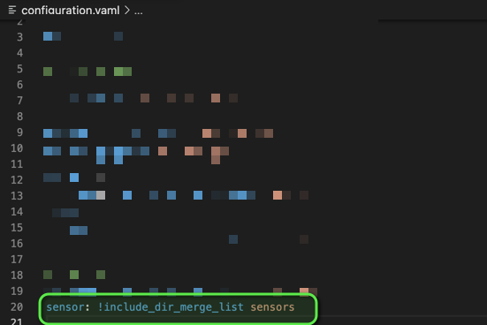
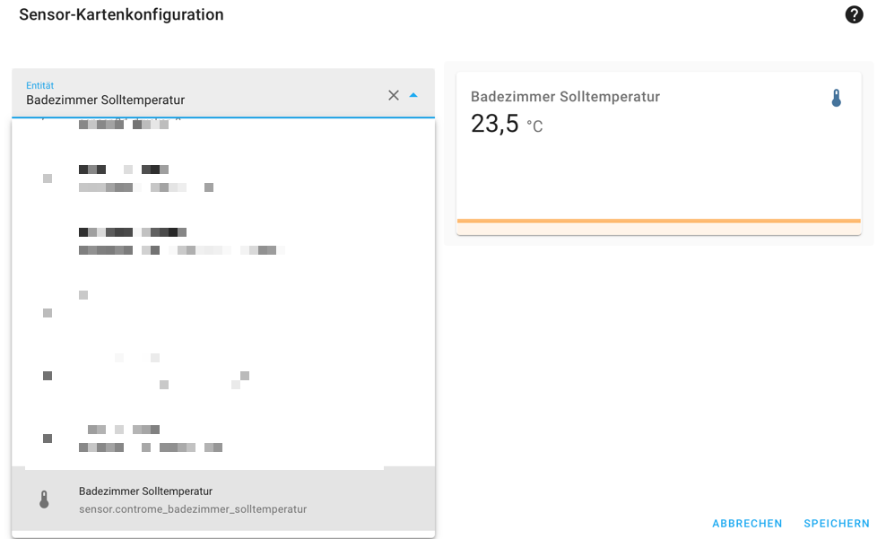

# Home-Assistant-Controme-yaml-creator

## Configuration

I have created script to simplify the creation of the Controme Hassio sensors.

You only have to change the $ContromeServerURL to your own Controme server address.

    How I have implemented it:
    1. create a sensors folder in your config folder
    2. copy the controme.yaml into the sensors folder
    

    3. extend your configuration.yaml with the following value "sensors: !include_dir_merge_list sensors"
    

    4.after that you should find your Controme rooms in the Hassio
    

    5. now you can add the sensor to a dashboard
    

## Troubleshooting:
[API – Controme Support Center](https://support.controme.com/api/#Problembehebung)
1. /get/json/v1/2/temps und nicht /get/json/v1/1/temps
    
        API – Controme Support Center:

        API gibt nichts aus
        Bitte prüfen Sie in diesem Fall zunächst, ob Sie die korrekte Haus-ID verwenden. Aus unterschiedlichen Gründen ist die ID manchmal „2“ und nicht „1“. Der korrekte Endpunkt ist deshalb bei einigen Systemen z.b.

        /get/json/v1/2/temps
        und nicht
        /get/json/v1/1/temps

2. No umlauts (like Küche  or Büro) may be used.
