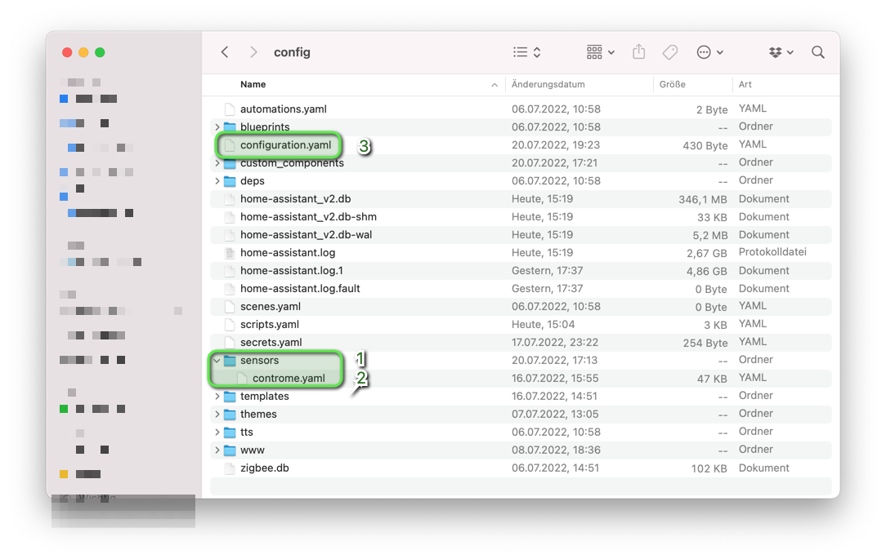
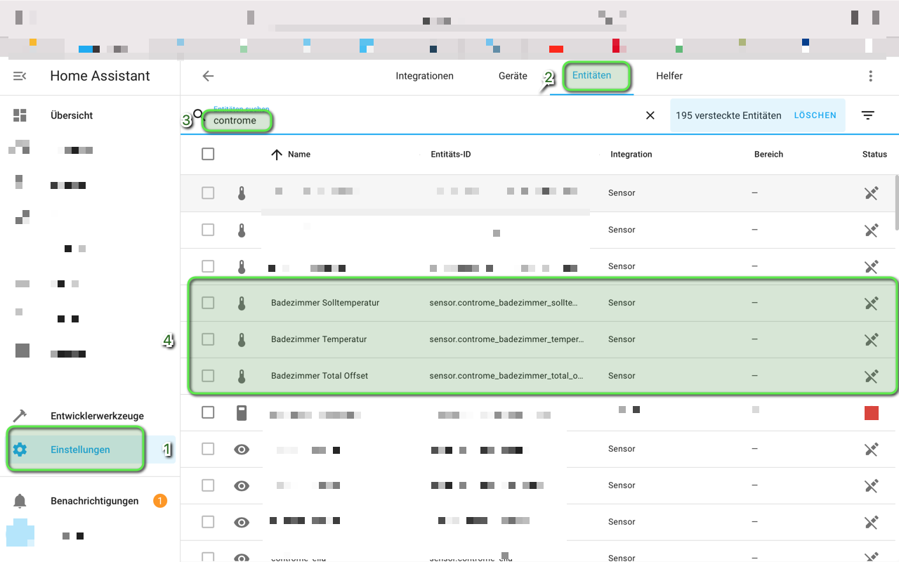

# Home-Assistant-Controme-yaml-creator

I have created script to simplify the creation of the Controme Hassio sensors.

You only have to change the $ContromeServerURL to your own Controme server address.

How I have implemented it:
1. create a sensors folder in your config folder
2. copy the controme.yaml into the sensors folder

3. extend your configuration.yaml with the following value "sensors: !include_dir_merge_list sensors"

4.after that you should find your Controme rooms in the Hassio

